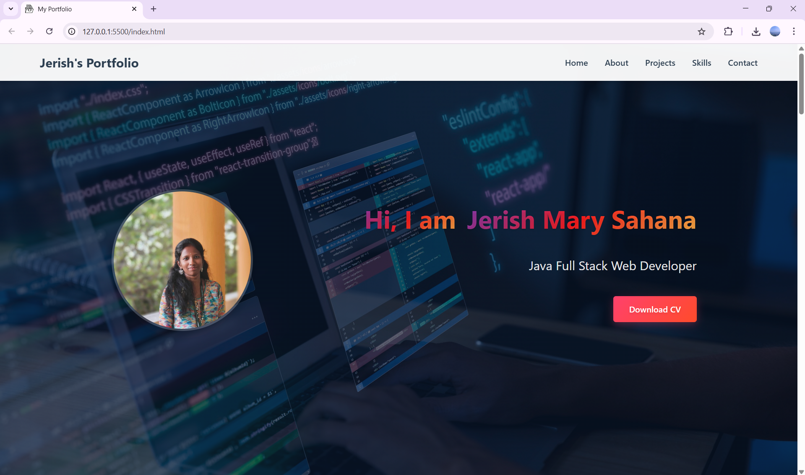
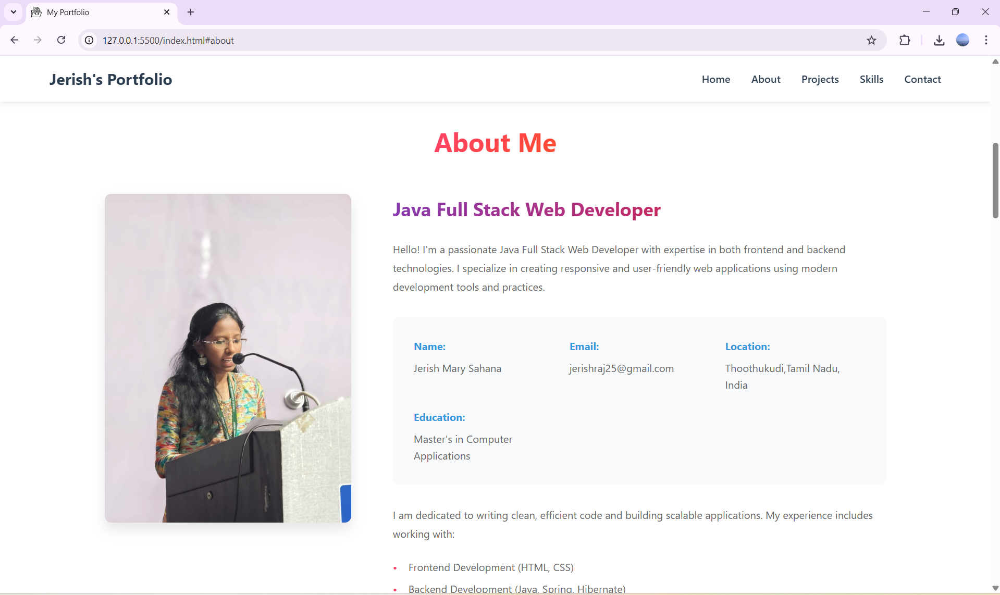
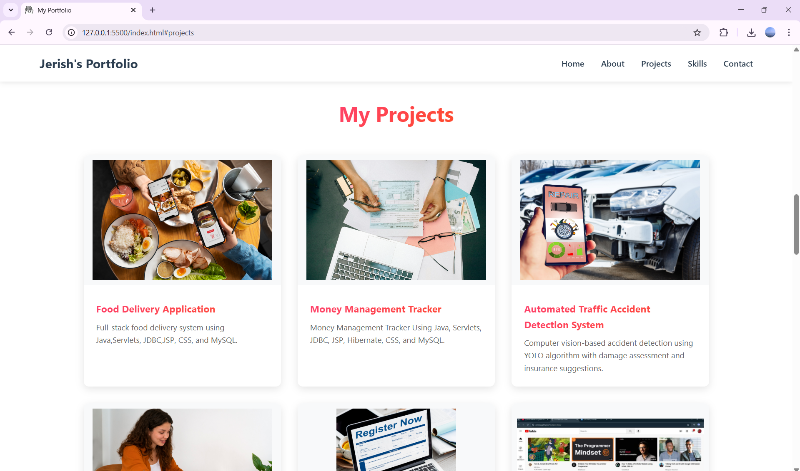
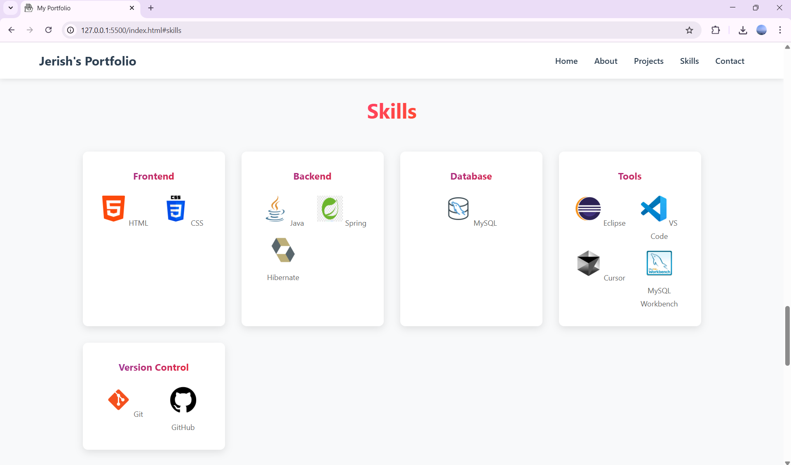
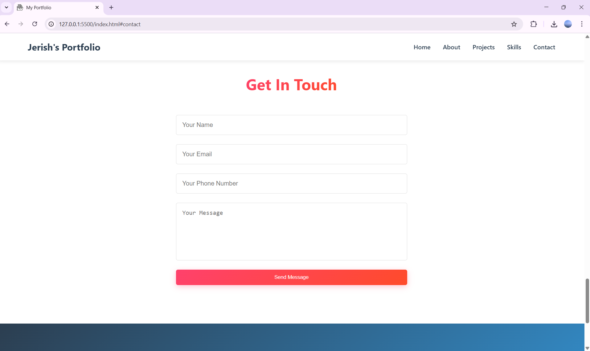
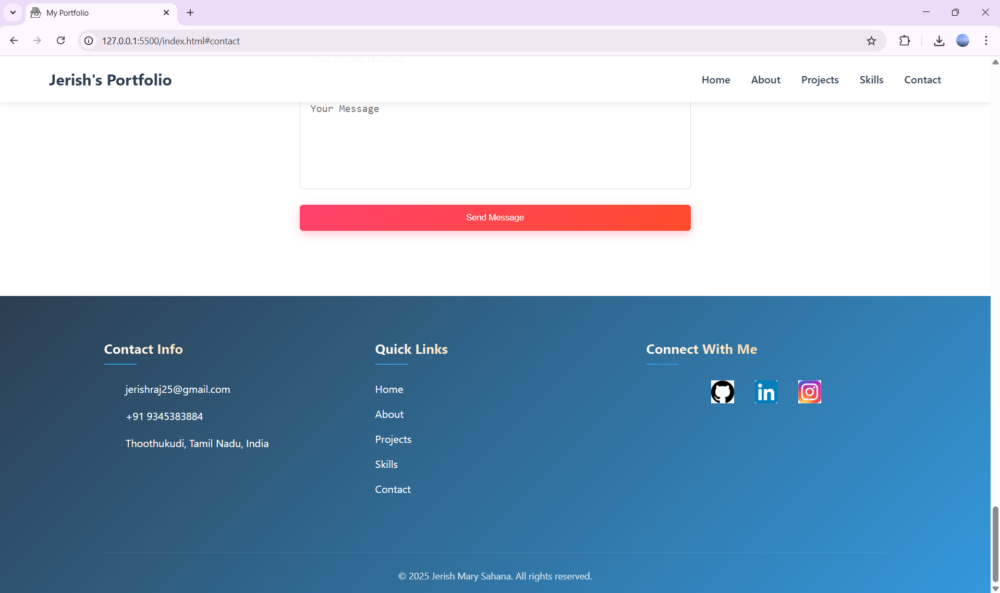

# 💼 Jerish Mary Sahana - Portfolio Website

Welcome to my personal portfolio website! This project showcases my skills, projects, and contact details as a **Java Full Stack Web Developer**. It is fully built using **HTML** and **CSS**, highlighting a clean and responsive design.

🔗 **Live Demo**: [jerishraj.github.io/MyPortfolio](https://jerishraj.github.io/MyPortfolio)

---

## 📌 About the Project

This portfolio provides an overview of who I am, the technologies I work with, and projects I’ve built using Java and web development tools. It features sections like:

- 🔹 Hero (Introduction)
- 🔹 About Me
- 🔹 Project Gallery
- 🔹 Skills
- 🔹 Contact Form
- 🔹 Footer with social media links

---

## 🛠️ Tech Stack

| Frontend   | Tools & Platforms  | Version Control |
|------------|--------------------|------------------|
| HTML5      | VS Code, Eclipse   | Git              |
| CSS3       | MySQL Workbench    | GitHub           |
| Font Awesome Icons | Cursor IDE       |                |

---

## 🗂️ Featured Projects

Here are a few projects displayed on this portfolio:

- 🍕 **[Food Delivery Application](https://jerishraj.github.io/Foodie_App/)**  
  Full-stack food ordering system using Java, Servlets, JSP, JDBC & MySQL.

- 💰 **[Money Management Tracker](https://jerishraj.github.io/Money_Management_Tracker/)**  
  Expense tracker using Hibernate, JSP, and MySQL.

- 🚗 **[Accident Detection System](https://jerishraj.github.io/Automated-Traffic-Accident-Detection/)**  
  AI-based accident detection using YOLO & insurance assistance.

- 🎓 **[Student Course Registration](https://jerishraj.github.io/Student_Course_Registration/)**  
  Console-based Java-MySQL course registration system.

- 🎥 **[YouTube UI Clone](https://jerishraj.github.io/Youtube-clone/)**  
  Frontend clone using HTML and CSS.

---

## 🧠 Skills Displayed

- **Frontend**: HTML, CSS  
- **Backend**: Java, Spring, Hibernate  
- **Database**: MySQL  
- **Version Control**: Git & GitHub  
- **Tools**: Eclipse, VS Code, MySQL Workbench

---

## 📬 Contact

If you’d like to connect or collaborate:

- 📧 **Email**: jerishraj25@gmail.com  
- 📍 **Location**: Thoothukudi, Tamil Nadu, India  
- 💼 **LinkedIn**: [@jerishmarysahana161002](https://www.linkedin.com/in/jerishmarysahana161002/)  
- 💻 **GitHub**: [@JerishRaj](https://github.com/JerishRaj)  
- 📸 **Instagram**: [@_sahana16_](https://www.instagram.com/_sahana16_)

---

## 📸 Screenshots

### 🔹 Hero Section  

### 🔹 About Me  

### 🔹 Projects  

### 🔹 Skills  

### 🔹 Contact Me  

### 🔹 Footer  

---

## 📄 License

This project is open for viewing and inspiration, but please do not copy content or designs directly without permission.

---

### ⭐ Thank you for visiting my portfolio!
